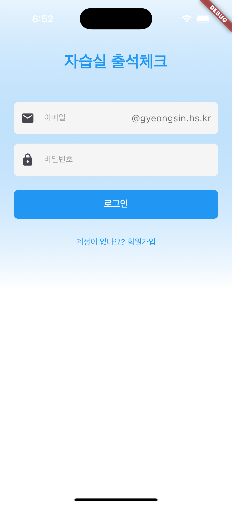
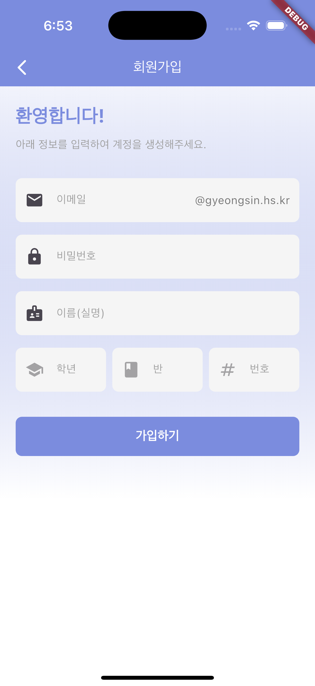
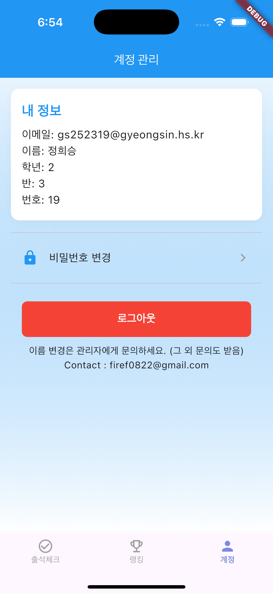
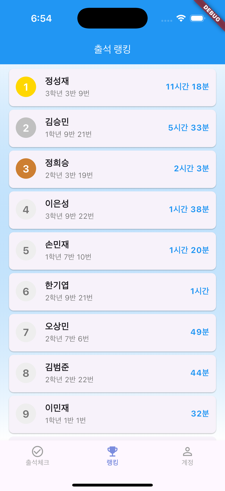
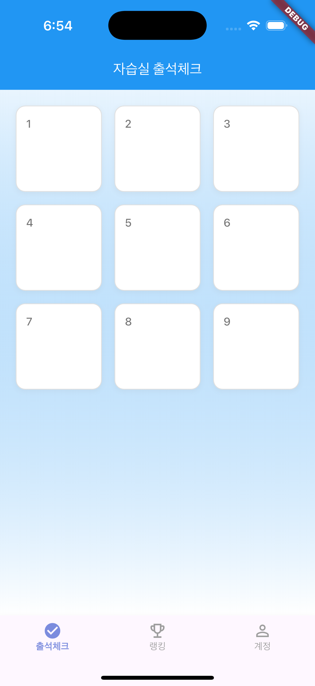
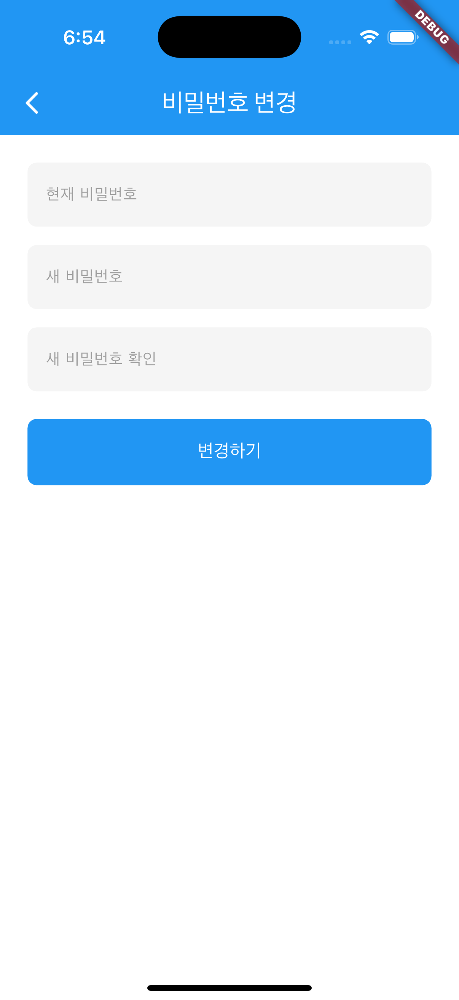

# 📱 GS 자습실 체크

**GS 자습실 체크**는 기존의 **아날로그식 출석체크 방식을 디지털로 전환**하기 위해 개발된 Flutter 기반 앱입니다.  
학교 학술제 제출작으로 제작되었으며, **편의성 · 접근성 · 활용성**을 모두 고려한 출석 관리 시스템을 제공합니다.  

---

## ✨ 주요 특징

- 📝 **디지털 출석체크**  
  더 이상 종이에 기록하지 않아도 됩니다! 앱에서 간편하게 출석을 확인할 수 있습니다.

- 🚀 **편의성 강화**  
  누구나 쉽게 사용할 수 있는 직관적인 UI/UX를 적용했습니다.  

- 🌍 **접근성 확대**  
  모바일 환경(Android · iOS) 어디서든 동일하게 이용 가능합니다.  

- 📊 **활용성 강조**  
  단순히 출석 기록에 그치지 않고, 데이터를 기반으로 다양한 기능(예: 랭킹 시스템)을 확장할 수 있습니다.  

---

## 🛠️ 기술 스택

- **언어**: Dart  
- **프레임워크**: Flutter  
- **백엔드**: Firebase (인증 & 데이터베이스)  

---

## 🎯 개발 목적

- 기존 아날로그 출석체크 방식의 불편함 해소  
- 학습 환경에서의 **효율적 출석 관리**  
- 학생 및 교사를 위한 **실질적인 편리성 제공**  

---

## 📸 스크린샷

  
  

  
  

  
  

## 🏫 제작 정보

- 프로젝트명: **GS 자습실 체크**  
- 제작자: 2-3 정희승, 2-9 한기엽
- 출품 목적: **학교 학술제 제출용**  

---

## 📌 비전

단순한 출석체크 앱을 넘어,  
**학생의 학습 시간을 효율적으로 관리**하고,  
**학교 생활 전반에 도움이 되는 스마트 도구**로 확장하는 것을 목표로 합니다. ✨
